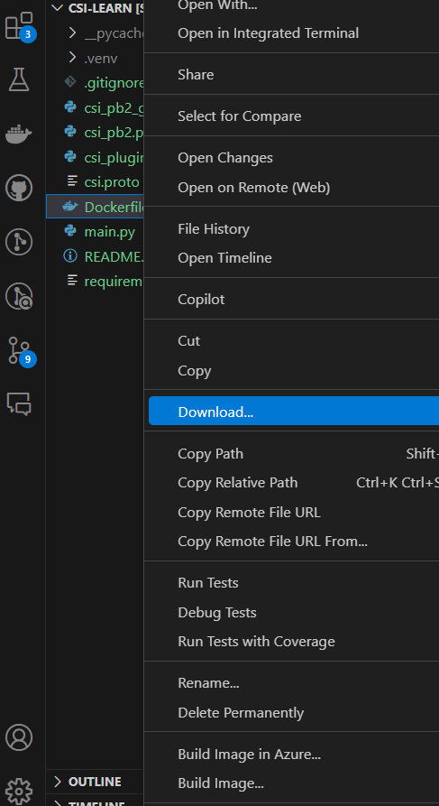
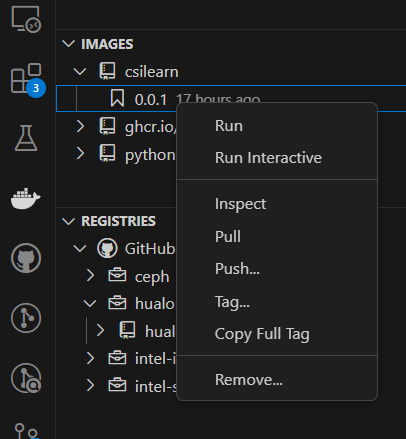

# CSI learn

## 准备工作

### 1.1 环境准备
### 1.2 安装依赖
安装所需的 Python 包：
```
pip install grpcio grpcio-tools  
```
### 1.3 下载CSI规范protobuf文件
从 CSI 官方仓库下载 protobuf 文件：
```bash
wget https://raw.githubusercontent.com/container-storage-interface/spec/master/csi.proto  
```
然后生成Python代码
```bash
python -m grpc_tools.protoc -I. --python_out=. --grpc_python_out=. csi.proto  
```
这会生成两个文件：`csi_pb2.py` 和 `csi_pb2_grpc.py`，这是 CSI 接口的 Python gRPC 实现。

## 2 实现CSI插件

## 3. 构建CSI插件

### 3.1 编写Dockerfile
创建一个 `Dockerfile` 来构建 CSI 插件镜像

### 3.2 构建镜像


### 3.3 推送镜像到github
